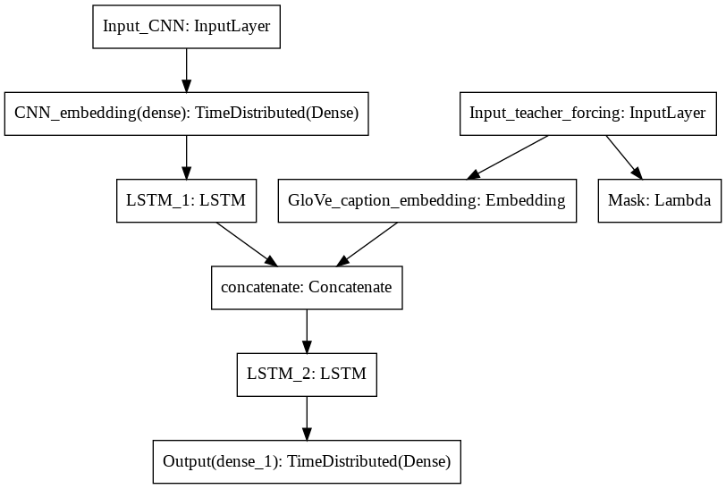

# video_to_text_caption
Generating text captions based on a video. 

Model architecture:

Examples:

Based on the [Sequence to Sequence -- Video to Text (Venugopalan et al.)](https://arxiv.org/abs/1505.00487) paper with following modifications:
- Added pre-trained GloVe embeddings
- Used a newer pre-trained CNN model ([EfficientNet](https://tfhub.dev/tensorflow/efficientnet/b4/feature-vector/1))
- 

Data:
MSVD dataset

